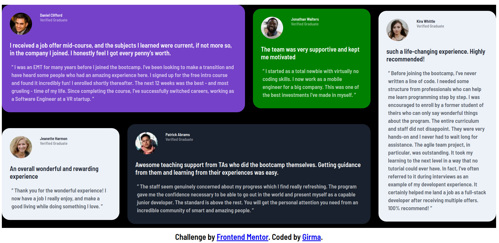

This is a solution to the [Testimonials grid section challenge on Frontend Mentor](https://www.frontendmentor.io/challenges/testimonials-grid-section-Nnw6J7Un7). Frontend Mentor challenges help you improve your coding skills by building realistic projects. 

The challenge was to make it responsive for the user

here it is the screenshot of the solution on difreent screen size

*Links
 - Live Site URL:(https://girma3.github.io/testimonials-grid-section/)

This project is about creating responsive testimonial card with grid layout  in this project I use
    -HTML
    -CSS
    -Grid
    -Mobile-first workflow

*In this project I learned more about grid and positioning items using grid area by name.and I want to be more  comfortable and improved my skill to build  grid layouts  for diffrent projects  in future.

*useful resource
  https://www.smashingmagazine.com/understanding-css-grid-template-areas

*Autor
  Frontend Mentor - [@Girma3](https://www.frontendmentor.io/profile/Girma3)